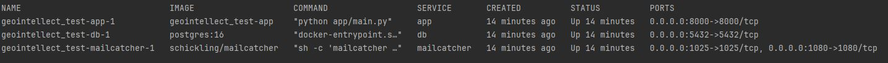
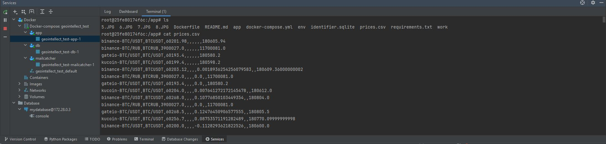
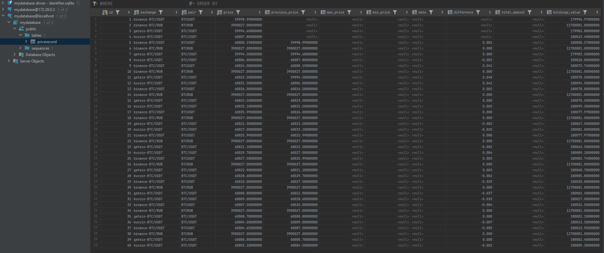
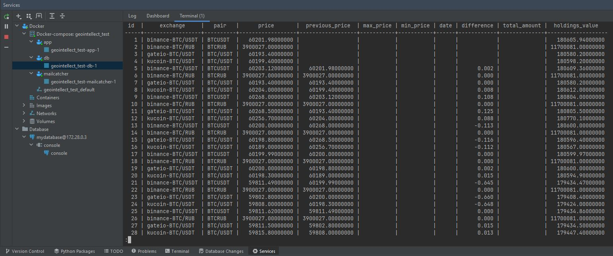
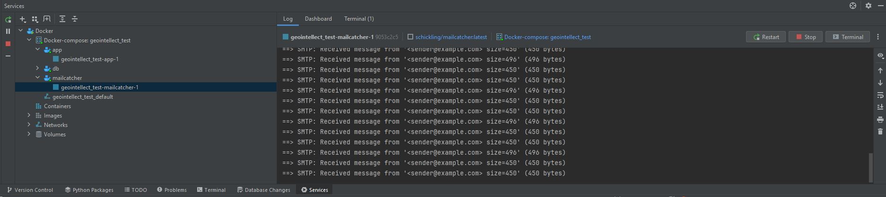
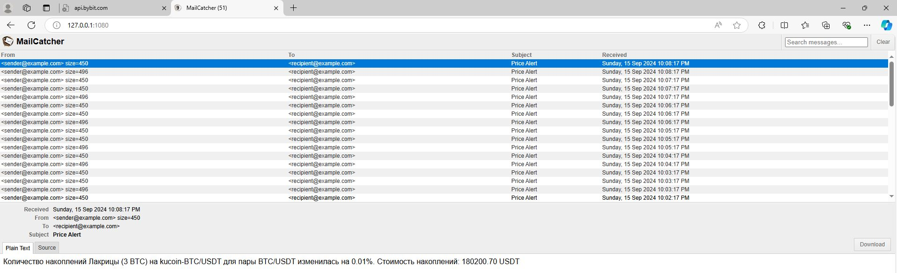
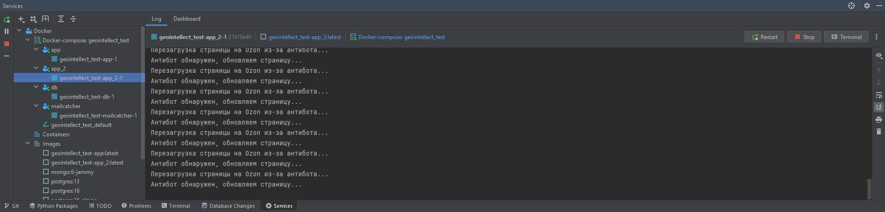

# Тестовое задание от Geointellect

## ТЗ

В тридевятом царстве, в тридесятом государстве жил мальчик по имени Лакрица. Он был из небогатой
семьи, ему приходилось столетиями копить деньги на свои нужды.
Но по истечении некоторого количества лет по мере накопления нужной суммы необходимость в покупке
пропадала. В недавнюю пору открыли замечательный магазин.
В этом магазине можно было купить с хорошей скидкой разные восхитительные товары. Лакрица, подумав,
решил, что если он будет следить за ценой товаров в
ожидании скидочного предложения, то сможет приобрести необходимый продукт.

109 лет спустя.
Лакрица так и не смог поймать волну скидок, даже в черную пятницу. Он собирал шишки в лесу с таким
усердием, что очнулся только через неделю после окончания
скидочных предложений. Но за эти годы Лакрица накопил 3 BTC.

Задание 1
Давай поможем Лакрице выгодно продать валюту. Будем мониторить цену на биткоин на разных биржах:
https://www.binance.com/ru
https://coinmarketcap.com/ru/
https://www.bybit.com/ru-RU/
https://www.gate.io/ru
https://www.kucoin.com/ru

Мы хотим получить лучшее предложение. Для этого нам нужно отслеживать следующие пары валют:
BTC/USDT
BTC/ETH
BTC/XMR
BTC/SOL
BTC/RUB
BTC/DOGE
При росте курса >= 0.03% мы хотим получать на email письмо, в котором будет стоимость накоплений в
валюте и разница.

Мы хотим каждое повышение цены фиксировать в таблицу csv.
Header_line=title,price,max price,min price, date ISOformat, difference, total amount.
Лучшим вариантом будет запись в базу. СУБД Tortoise ORM + PgSql, в крайнем случае sqlite. Лакрица
хочет иметь возможность искать, редактировать, удалять записи.

Так как Лакрица мечтает стать программистом, мы дадим ему данные в формате json:
key_json={
“title”:str,
“kash”:[{
“price”:decimal,
“minmax”:[{
“max price”:decimal,
”max price”:decimal}]],
”difference”:decimal,
”total amount”:decimal,
“coins”: [
{“BTC“:“USDT“,............“BTC“:“DOGE“}]
“date”:str}
Для этого нелегкого дела нам можно использовать: csv, aiohttp, MailCatcher, Docker, mongodb or
pgSQL,schedule, Tortoise ORM.

Код должен быть залит на гит с описанием, чтобы Лакрица мог легко запустить его. Позже мы поможем
Лакрице собрать данные с маркетплейсов и купить наконец
желанные копье, дуршлаг, красные носки и леску для спиннинга.

Задание 2
Спустя 33 дня, 33 часа и 33 минуты начались скидки на маркетплейсах (далее МП):

https://www.wildberries.ru/
https://www.ozon.ru/?__rr=1
https://market.yandex.ru/

Лакрица обрел богатый опыт джуна на практике. Об этом свидетельствовало его портфолио на сайте
я-кодер.рф.
Пришло время мониторить цены на желанные товары на вышеуказанных МП. Нам необходимо взять по 1
карточке товара с наименьшей ценой по ключам (копье, дуршлаг,
красные носки, леска для спиннинга). Данные из карточек сохранять аналогично первому заданию
“Мониторинг битка”.

Мы можем использовать любую из поддерживаемых библиотек: Playwright, Selenium/GRID, Splash, Scrapy.

Дополнительно можно завернуть все в ThreadPool. Но это необязательно.

Да пребудет с нами здравый смысл и самостоятельная работа!

## Решение.

Задача: Создать скрипт, который мониторит цену на биткоин на разных биржах, фиксирует изменения в 
таблицу csv или базу данных, и отправляет уведомления на email при росте курса >= 0.03%.

Требования:

- Мониторинг цен на биткоин на разных биржах
- Фиксация изменений в таблицу csv или базу данных
- Отправка уведомлений на email при росте курса >= 0.03%
- Возможность искать, редактировать, удалять записи в базе данных
- Данные в формате json

План действий:

1. Выбор библиотек и инструментов:
 - Для мониторинга цен на биржах: aiohttp
 - Для работы с csv: csv
 - Для работы с базой данных: Tortoise ORM + PgSql (или sqlite в качестве альтернативы)
 - Для отправки уведомлений на email: MailCatcher
 - Для планирования задач: schedule 
2. Создание структуры данных:
 - Создать таблицу в базе данных для хранения данных о ценах
 - Создать структуру данных в формате json для хранения данных о ценах
3. Мониторинг цен на биржах:
 - Использовать aiohttp для запроса цен на биржах
 - Обработать ответы от бирж и сохранить данные в базе данных или csv
4. Фиксация изменений в базе данных или csv:
 - Использовать Tortoise ORM для работы с базой данных
 - Использовать csv для работы с csv
5. Отправка уведомлений на email:
 - Использовать MailCatcher для отправки уведомлений на email
6. Планирование задач:
 - Использовать schedule для планирования задач

Код: Начнем с создания структуры данных и мониторинга цен на биржах. Затем мы добавим функционал 
для фиксации изменений в базе данных или csv, отправки уведомлений на email и планирования задач.

## Как запустить проект в Docker

### Предварительные требования

Перед тем как начать, убедитесь, что у вас установлены следующие программы:

- [Docker](https://docs.docker.com/get-docker/)
- [Docker Compose](https://docs.docker.com/compose/install/)

### Шаги для запуска

#### 1. Клонируйте репозиторий

Откройте терминал или командную строку и выполните команду для клонирования репозитория:

```bash
git clone <ссылка_на_ваш_репозиторий>
```

#### 2. Перейдите в директорию проекта

Перейдите в директорию проекта:
```bash
cd <название_вашего_проекта>
```

#### 3. Настройте файл .env

Создайте файл .env в корне проекта на основе следующего шаблона env

#### 4. Соберите Docker-контейнеры
Запустите Docker Compose для сборки и запуска контейнеров:
```bash
docker-compose up --build
```
Эта команда соберет контейнеры для вашего приложения, базы данных PostgreSQL и MailCatcher.

#### 5. Проверьте, что контейнеры работают
Для проверки статуса контейнеров выполните команду:
```bash
docker-compose ps
```
Вы должны увидеть что-то похожее:


#### 6. Откройте веб-интерфейс MailCatcher
Откройте браузер и перейдите по адресу(Сейчас порог настроен # Порог в 0.01% по модулю(для теста):
```
http://127.0.0.1:1080/
```
### Скриншоты

Данные сохраняются в файл CSV в корне проекта
(в конечном варианте добавлена дата и время полученных данных в БД и CSV).


Данные сохраняются в базу данных PostgreSQL
(в конечном варианте добавлена дата и время полученных данных в БД и CSV).





Сообщения отправляются на почту.


В сообщениих содержится информация об изменении цены и стоимость накоплений.


## Решение.

Задание 2
Спустя 33 дня, 33 часа и 33 минуты начались скидки на маркетплейсах (далее МП):

https://www.wildberries.ru/
https://www.ozon.ru/?__rr=1
https://market.yandex.ru/

Лакрица обрел богатый опыт джуна на практике. Об этом свидетельствовало его портфолио на сайте
я-кодер.рф.
Пришло время мониторить цены на желанные товары на вышеуказанных МП. Нам необходимо взять по 1
карточке товара с наименьшей ценой по ключам (копье, дуршлаг,
красные носки, леска для спиннинга). Данные из карточек сохранять аналогично первому заданию
“Мониторинг битка”.

Мы можем использовать любую из поддерживаемых библиотек: Playwright, Selenium/GRID, Splash, Scrapy.

Дополнительно можно завернуть все в ThreadPool. Но это необязательно.

### Небольшое отступление(Интеграция с API маркетплейсов)
Чтобы не было проблем с антиботами и при коммерческой разработке нужно пользоваться API МП

#### 1. API Wildberries

Wildberries предоставляет открытое API для поставщиков, через которое можно работать с заказами,
остатками, ценами и другими данными.

##### Основные возможности API:
- Получение информации о заказах, возвратах, остатках.
- Управление ценами и акциями.
- Управление товарами и карточками товаров.

##### Документация API:
[Документация API Wildberries](https://openapi.wildberries.ru/)

##### Пример использования API:

```python
import requests

url = "https://suppliers-api.wildberries.ru/public/api/v1/info"
headers = {
    'Authorization': 'Bearer <your_token>'
}
response = requests.get(url, headers=headers)
print(response.json())
```
##### Регистрация в API:
Чтобы начать пользоваться API, нужно зарегистрироваться на платформе для партнеров Wildberries и 
получить API ключ для авторизации запросов.

##### Аналогично для других МП

### Проверка работы второго приложения.

#### 1. Тестируем без docker

Лучше протестировать без запуска в контейнере т.к. в контейнере долго устанавливается 
плагин playwright и вероятно МП окончательно заблокируют работу парсера(разценив его, как бота).

Алгоритм следующий:
- Отключаем VPN;
- В файле .env добавляем свои данные(все такие же, как в первом задании);
- В файле scraper.py можем настроить визулятор браузера 156 строка кода 
(headless=False)  # не забываем менять на True, если работаем в докере);
- Запускаем приложение через файл main.py.

ссылка на запись работы парсера: https://drive.google.com/file/d/1SlkBYyqqRinIVKvDJvqofhaTi_OI505n/view?usp=sharing
#### 2. Тестируем с docker

Алгоритм следующий:
- В файле .env добавляем свои данные(все такие же, как в первом задании);
- В файле scraper.py можем отключаем визулятор браузера 156 строка кода 
(headless=False)  # не забываем менять на True, если работаем в докере);
- Раскомментировать строчки в файле docker-compose.yml;
- docker-compose down  - удаляет все образы и сервисы;
- docker-compose up --build  - собирает образы и запускает сервисы;

В итоге будет выглядеть так(МП окончательно заблокировал работу парсера(разценив его, как бота)):


*парсинг ЯМ в разработке, можно ознакомиться в файле scraper_testYM.py*